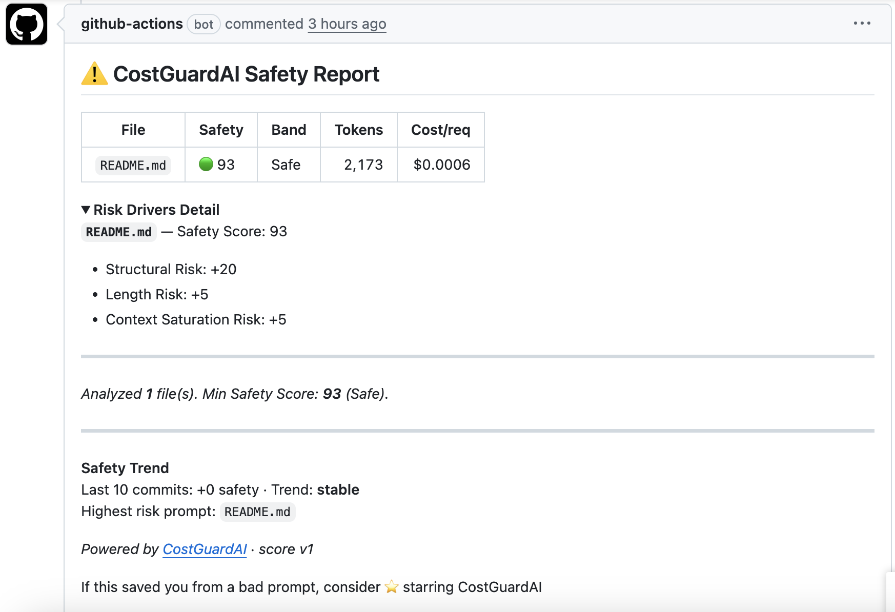

# CostGuardAI GitHub Action

Catch expensive and unsafe AI prompts before they reach production.

- Detect token explosions and hidden costs
- Generate a CostGuardAI Safety Score on every PR
- Fail CI when prompts fall below your Safety Score threshold

```yaml
- uses: Camj78/costguardai-action@v1
```

Runs automatically in GitHub Actions to analyze prompts before merge.

## Example PR Output



## Usage

```yaml
- uses: Camj78/costguardai-action@v1
  with:
    fail-on-risk: 70
```

Add this step to any workflow that runs on pull requests. The action fails if the CostGuardAI Safety Score drops below the threshold.

## Inputs

| Input          | Required | Default | Description                                                      |
| -------------- | -------- | ------- | ---------------------------------------------------------------- |
| `fail-on-risk` | No       | `70`    | Fail the workflow if Safety Score falls below this value (0–100) |

## Example workflow

```yaml
name: CostGuardAI
on: [pull_request]

jobs:
  costguard:
    runs-on: ubuntu-latest
    steps:
      - uses: actions/checkout@v4
      - uses: Camj78/costguardai-action@v1
        with:
          fail-on-risk: 70
```

## How it works

Runs the CostGuardAI CLI via `npx @camj78/costguardai@latest ci`.
